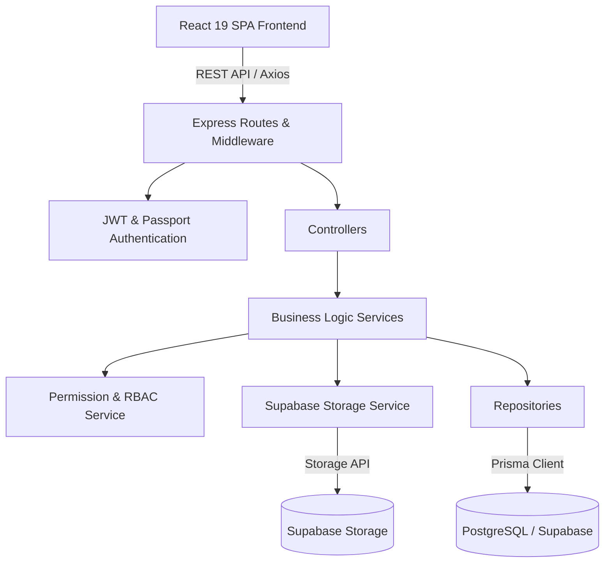
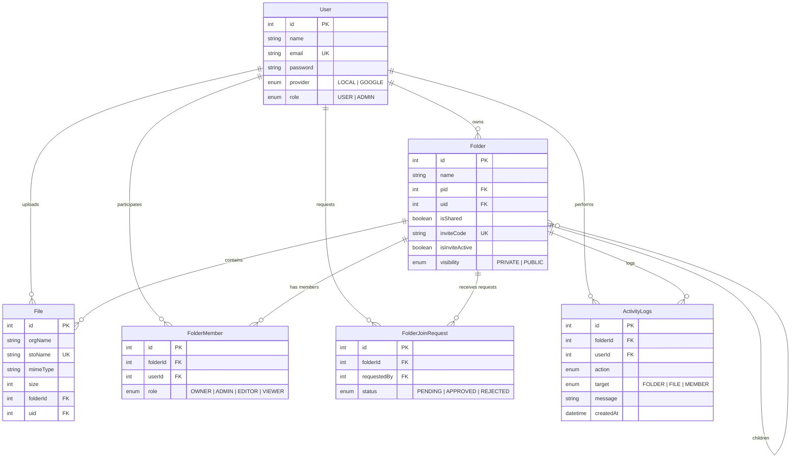

# 📦 CloudBox — Distributed Cloud Storage Platform

[](https://nodejs.org/)
[](https://expressjs.com/)
[](https://react.dev/)
[](https://vitejs.dev/)
[](https://www.prisma.io/)
[](https://www.postgresql.org/)
[](https://supabase.com/)
[](https://www.docker.com/)

> **CloudBox** is a high-performance, distributed cloud storage & collaboration platform inspired by Google Drive, Dropbox, and GitHub permission models. Built with **Node.js**, **Express**, **Prisma ORM**, **PostgreSQL**, **Supabase Storage**, and **React 19**.

---

## 🌟 Key Features

### 📁 Advanced Directory & File Management

* **Hierarchical Directory Tree**

  * Support for deeply nested folders
  * Breadcrumb navigation
  * Real-time path calculations

* **HTML5 Drag & Drop Moving System**

  * Drag files and subfolders directly onto:

    * Sidebar tree nodes
    * Table rows
    * Breadcrumb pills

* **File Preview Modal**

  * Native in-browser streaming and rendering for:

    * 🖼️ **Images:** JPEG, PNG, GIF, SVG, WebP
    * 📄 **Documents:** PDF viewing via embedded frame
    * 🎥 **Video & Audio:** HTML5 video & audio streaming
    * 💻 **Code & Text:** JSON, JavaScript, Python, Markdown, HTML, and plain text files

---

### 🔐 Granular Security & Permissions

CloudBox implements a **Role-Based Access Control (RBAC)** system inspired by Linux and GitHub permission models.

| Role       | Permissions                                                                                       |
| ---------- | ------------------------------------------------------------------------------------------------- |
| **OWNER**  | Full administrative control, invite code management, role assignment, and ownership transfer      |
| **ADMIN**  | Manage folder members, approve/reject join requests, upload, edit, rename, move, and delete items |
| **EDITOR** | Upload, edit, rename, and move files/folders                                                      |
| **VIEWER** | Read-only access to view and download files                                                       |

### ⚡ Permission Service

* Decoupled permission service
* Constant-time permission checking layer
* Folder hierarchy-aware permission evaluation

---

### 🤝 Shared Folders & Collaboration Workflows

* **Invite Codes**

  * Unique, regenerable folder invite codes
  * Toggleable active/inactive status

* **Join Request Workflow**

  * Users can submit join requests using invite codes
  * Owners/Admins can approve or reject requests

* **Ownership Transfer**

  * Folder owners can transfer ownership
  * Ownership can be transferred to an existing folder administrator

---

### 📜 Comprehensive Audit Logging

CloudBox includes a centralized activity logging service that records important actions across the platform lifecycle.

Logged activities include:

* Folder creation, renaming, moving, deletion, and sharing
* File uploading, renaming, moving, and deletion
* Member join requests
* Join request approvals/rejections
* Role updates
* Ownership transfers

---

### ☁️ Enterprise Cloud Storage (Supabase Integration)

* High-throughput file uploads and streaming downloads powered by **Supabase Storage**.
* Automatic MIME-type detection and object key generation with collision prevention.

---

### 🐳 Containerized Deployment (Docker)

* Production-ready multi-stage **Dockerfile** for lean and secure deployments.
* Build tools isolated in builder stages; runtime uses a lightweight, secure non-root user.

---

# 🏗️ System Architecture

CloudBox follows a **Clean Layered Architecture**.

The **Repository layer is the only layer responsible for interacting with Prisma ORM and PostgreSQL**. Services contain the core business logic and do not directly query the database.



---

# 🛠️ Tech Stack

| Layer                | Technologies                                                               |
| -------------------- | -------------------------------------------------------------------------- |
| **Frontend**         | React 19, Vite 7, React Router 7, Axios, Oxlint, Vanilla CSS Design System |
| **Backend**          | Node.js (ES Modules), Express 5.x, Passport.js, Google OAuth2, JWT, Multer |
| **Database**         | PostgreSQL 16+, Supabase, Prisma ORM 7.x                                   |
| **Object Storage**   | Supabase Storage                                                           |
| **Authentication**   | JWT, Passport.js, Google OAuth2                                            |
| **Containerization** | Docker                                                                     |
| **Testing & Tools**  | Jest, Supertest, Nodemon, Morgan, Pino Logging                             |

---

# 📊 Database Schema & Data Models

CloudBox uses PostgreSQL with Prisma ORM for structured application data.



---

# 🚀 Getting Started

## Prerequisites

Make sure you have the following installed:

* **Node.js v20+**
* **npm**
* **PostgreSQL v16+**
* **Supabase account**
* **Docker** *(optional, for containerized deployment)*

---

## 1. ☁️ Supabase Database & Storage Setup

Create a project on **Supabase**.

### Database

Supabase provides the PostgreSQL database used by CloudBox.

Configure the database connection strings in your backend `.env` file:

```env
DATABASE_URL="your-supabase-database-url"
DIRECT_URL="your-supabase-direct-url"
```

### Storage

Go to **Storage** in your Supabase dashboard and create a bucket named:

```text
cloudbox-storage
```

---

## 2. 🐳 Docker Setup

CloudBox backend can be containerized using Docker.

### Build Docker Image

From the `Backend` directory:

```bash
docker build -t cloudbox-backend .
```

### Run Docker Container

```bash
docker run -d -p 3000:3000 \
  --name cloudbox-backend \
  cloudbox-backend
```

The backend will be available at:

```text
http://localhost:3000
```

---

## 3. ⚙️ Backend Setup

Navigate to the backend directory:

```bash
cd Backend
```

### Install Dependencies

```bash
npm install
```

### Configure Environment Variables

Create a `.env` file inside the `Backend/` directory:

```env
PORT=3000
NODE_ENV=development

DATABASE_URL="your-supabase-database-url"
DIRECT_URL="your-supabase-direct-url"

JWT_SECRET="your-access-secret"
JWT_SECRET_REF="your-refresh-secret"

GOOGLE_CLIENT_ID="your-google-client-id"
GOOGLE_CLIENT_SEC="your-google-client-secret"
GOOGLE_CALLBACK_URL="http://localhost:3000/api/auth/google/callback"

FRONTEND_URL="http://localhost:5173"

SUPABASE_URL="https://your-project.supabase.co"
SUPABASE_KEY="your-supabase-key"
SUPABASE_BUCKET="cloudbox-storage"
```

> ⚠️ **Security:** Never commit `.env` files or expose database passwords, JWT secrets, Google OAuth credentials, or Supabase keys publicly.

### Run Prisma Migrations

```bash
npx prisma migrate dev --name init
```

### Start Backend Server

```bash
npm run dev
```

The backend API will start at:

```text
http://localhost:3000
```

---

# 💻 4. Frontend Setup

Navigate to the frontend directory:

```bash
cd ../Frontend
```

### Install Dependencies

```bash
npm install
```

### Configure Environment Variables

Create a `.env` file inside `Frontend/`:

```env
VITE_API_BASE_URL="http://localhost:3000"
```

### Start Development Server

```bash
npm run dev
```

Open the application in your browser:

```text
http://localhost:5173
```

---

# 📡 REST API Endpoints

## 🔑 Authentication

Base route:

```text
/api/auth
```

| Method | Endpoint             | Description                      | Auth Required |
| ------ | -------------------- | -------------------------------- | :-----------: |
| `POST` | `/api/auth/register` | Register a new user account      |       ❌       |
| `POST` | `/api/auth/login`    | Authenticate user and issue JWT  |       ❌       |
| `GET`  | `/api/auth/me`       | Fetch authenticated user profile |       ✅       |
| `GET`  | `/api/auth/google`   | Initiate Google OAuth2 flow      |       ❌       |

---

## 📁 Folders

Base route:

```text
/api/folder
```

| Method   | Endpoint                         | Description                              | Auth Required |
| -------- | -------------------------------- | ---------------------------------------- | :-----------: |
| `POST`   | `/api/folder/create`             | Create a new private/shared folder       |       ✅       |
| `GET`    | `/api/folder/fetch`              | Get directory tree and folder items      |       ✅       |
| `PATCH`  | `/api/folder/rename/:id`         | Rename a folder                          |       ✅       |
| `PATCH`  | `/api/folder/move/:id/:pid`      | Move folder to target parent             |       ✅       |
| `DELETE` | `/api/folder/delete/:id`         | Delete folder and child contents         |       ✅       |
| `POST`   | `/api/folder/join`               | Request to join a folder via invite code |       ✅       |
| `GET`    | `/api/folder/requests/:folderId` | Get pending join requests                |       ✅       |
| `POST`   | `/api/folder/approve-request`    | Approve member join request              |       ✅       |
| `POST`   | `/api/folder/reject-request`     | Reject member join request               |       ✅       |

---

## 📄 Files

Base route:

```text
/api/file
```

| Method   | Endpoint                  | Description                                | Auth Required |
| -------- | ------------------------- | ------------------------------------------ | :-----------: |
| `POST`   | `/api/file/upload`        | Upload file to Supabase Storage            |       ✅       |
| `GET`    | `/api/file/download/:id`  | Stream/download file from Supabase Storage |       ✅       |
| `PATCH`  | `/api/file/rename/:id`    | Rename file                                |       ✅       |
| `PATCH`  | `/api/file/move/:id/:pid` | Move file to target folder                 |       ✅       |
| `DELETE` | `/api/file/delete/:id`    | Remove file metadata and Supabase object   |       ✅       |

---

## 📜 Activity Logs

Base route:

```text
/api/activity
```

| Method | Endpoint                  | Description                       | Auth Required |
| ------ | ------------------------- | --------------------------------- | :-----------: |
| `GET`  | `/api/activity/:folderId` | Fetch chronological activity logs |       ✅       |

---

# 🧪 Testing & Code Quality

CloudBox uses Jest and Supertest for backend testing.

### Backend Tests

```bash
cd Backend
npm test
```

### Frontend Linting

```bash
cd Frontend
npm run lint
```

### Frontend Production Build

```bash
npm run build
```

---

# 📂 Project Structure

```text
CloudBox/
│
├── Backend/
│   ├── prisma/
│   │   └── schema.prisma
│   │
│   ├── src/
│   │   ├── controllers/
│   │   ├── routes/
│   │   ├── services/
│   │   ├── repositories/
│   │   ├── middleware/
│   │   └── ...
│   │
│   ├── Dockerfile
│   ├── package.json
│   └── .env
│
├── Frontend/
│   ├── src/
│   ├── public/
│   ├── package.json
│   └── .env
│
└── README.md
```

---

# 🔒 Security

CloudBox implements multiple layers of security:

* JWT-based authentication
* Google OAuth2 authentication
* Role-Based Access Control (RBAC)
* Folder-level permissions
* Protected API routes
* Ownership-based access control
* Environment-based secret management
* Supabase Storage integration
* Centralized activity logging

> **Important:** Never commit `.env` files to GitHub. Use secure environment variables for production deployments.

---

# 🎯 Core Design Principles

CloudBox is designed around:

* **Clean Layered Architecture**
* **Separation of Concerns**
* **Repository Pattern**
* **Service-Based Business Logic**
* **Role-Based Authorization**
* **Scalable Cloud Storage**
* **Secure REST API Design**
* **Containerized Infrastructure**
* **Centralized Activity Logging**

---

# 🐳 Docker Support

CloudBox supports containerized infrastructure using Docker.

The backend includes a production-ready `Dockerfile` with:

* Multi-stage builds
* Build dependencies isolated from the production runtime
* Lightweight production runtime
* Secure non-root container user
* Environment-based configuration

### Build Docker Image

```bash
cd Backend
docker build -t cloudbox-backend .
```

### Run Docker Container

```bash
docker run -d -p 3000:3000 \
  --name cloudbox-backend \
  cloudbox-backend
```

---

# 🚧 Future Improvements

Potential future enhancements include:

* 🔄 File versioning
* 🗑️ Trash/recycle-bin functionality
* 🔗 Public file sharing links
* 🔍 Advanced file search
* 💬 File comments
* 🔔 Real-time notifications
* 📊 Storage usage analytics
* 📤 Resumable large-file uploads
* ⚡ CDN-based file delivery
* 👥 Real-time collaboration
* 🔐 More granular per-file permissions

---

# 📄 License

This project is open source and available under the **MIT License**.

---

## ⭐ Support

If you find **CloudBox** useful, consider giving the repository a ⭐ on GitHub.
